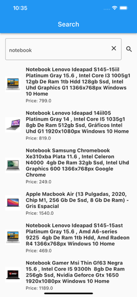

# adviqo_challenge

Project Structure

* core 
    * base
    * data_provider
* global
    * widgets
* other
* util
* view
    * detail
        * bloc
        * component
        * model
        * repo  
    * search
        * bloc
        * component
        * model
        * repo

Test structure

* test
    * unit_test
        * detail
        * resource
        * search

Some Screenshots of the App

 

# Tools
Bloc State management system
Dio for Api Calling
Mockito for Unit Testing

We have also implemented unit test cases for our two api and hive NoSql store product logic.

